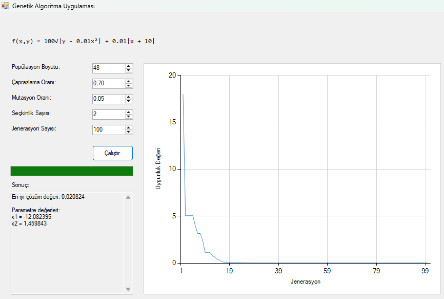

# 🧬 Genetik Algoritma Uygulaması

Bu proje, yapay zekanın temel dallarından biri olan genetik algoritmaların pratik uygulamasını gösteren bir Windows masaüstü uygulamasıdır.

## ✨ Özellikler
- Doğadaki evrim sürecini taklit eden algoritma
- Matematiksel optimizasyon problemlerini çözme
- Kullanıcı dostu arayüz
- Gerçek zamanlı yakınsama grafiği
- Parametre ayarlama (popülasyon boyutu, çaprazlama/mutasyon oranları)

## 🛠️ Teknolojiler
- C# Windows Forms
- Chart Controls
- BackgroundWorker

## 📷 Ekran Görüntüsü

## 🚀 Kullanım
1. Uygulamayı çalıştırın
2. Parametreleri ayarlayın
3. "Çalıştır" butonuna tıklayın
4. Algoritmanın yakınsama sürecini izleyin
